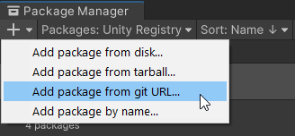
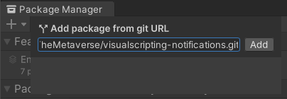
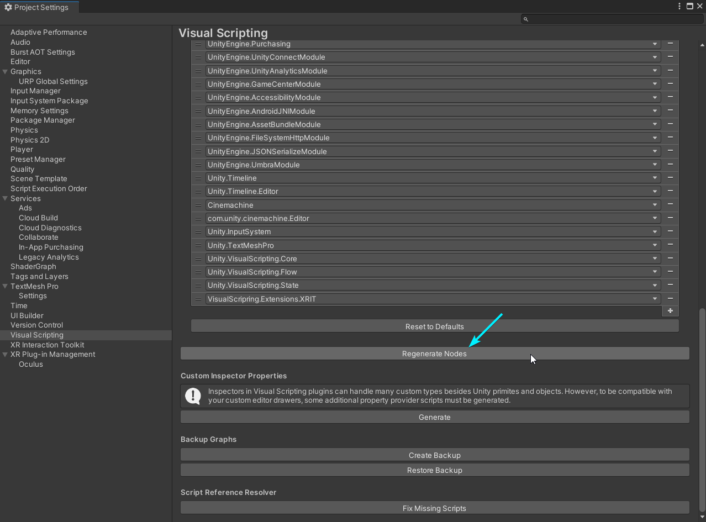
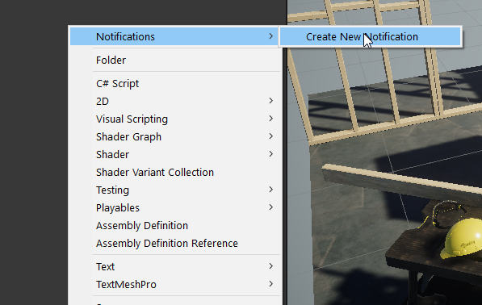
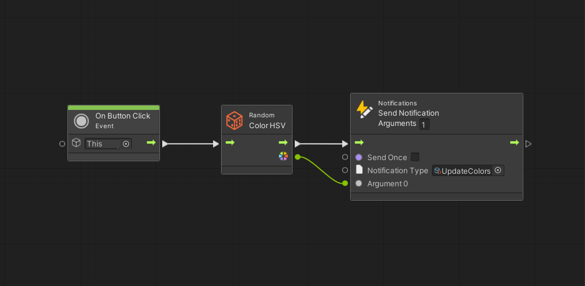
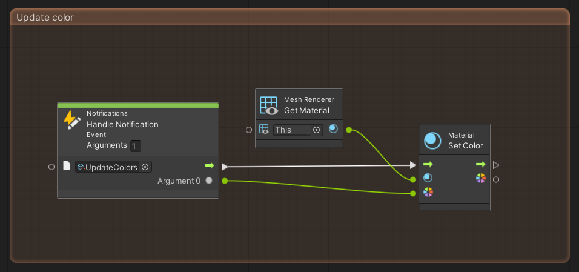

Visual Scripting Notifications
====

## Warning!
> This **experimental** package is **not officially** developed by Unity.  

>Unity does not support experimental packages and does not guarantee that experimental packages will be fully released and verified to be safe to use in production.

## About this project
As part of the [Road to Metaverse, Creator Series](https://create.unity.com/road-to-metaverse), I wanted a notification system to enforce decoupling and ensure more modular, scalable applications developed using Unity's Visual Scripting. This project also serves as a learning and documenting exercise to ensure better on-boarding as we start creating more complex experiences for the series.

 

# Getting started

Visual Scripting Notifications is a Unity [package](https://docs.unity3d.com/Manual/Packages.html). To import it into your Unity project follow the steps below:

1. Open your Unity project and select `Window > Package Manager` from the menu bar

    > This package requires Unity 2021.3 and above.

2. Click the `'+'` icon within the Package Manager and select `"Add package from git URL..."`

    

3. Paste *https://github.com/RoadToTheMetaverse/visualscripting-notifications.git* into the text field and click `"Add"`

    

4. Visual Scripting Notification is now installed in your Unity project as an read-only package within the project's `Packages` folder named `Visual Scripting Notifications`.

5. Open the Project Settings `Edit > Project Settings...` and select the `Visual Scripting` tab. 

6. Click `Generate Nodes` or `Regenerate Nodes`.

    

 

## **And you're done!**

 

# Usage

## Creating a new notification
Notifications types are Scriptable Objects. To create a new one, click the `+` button or `right mouse click > Create` in the Project window and select `Nofications >  Create New Notification`.

A new asset will be created. You can name it as you see fit. The asset contains a Notification Unique ID that is automatically generated. 

 

 > **Do not duplicate a notification**. Both notifications will have the same unique ID and this might create unexpected behaviours!

 

## Sending notifications
You can add a `Send Notification` unit to any Script Graph. It takes two arguments:

- Send Once: if true, the notification will be sent only once.
- Notification Type: a notification type asset, created in the previous step above. 

You can also send arguments with the notification. In the unit's header change the Argements value to the number of arguments needed. This will add the necessary port(s) to connect to.

## Handling notifications
Add a `Handle Notification` unit to any graph. Set the notification type it should handle. Add the necessary Argument port(s) to handle the data sent with the notification.

# Release note
## Version 0.0.1
- Initial release
- Created custom event nodes for Interactables & Teleporting
  - Notification Type
  - Send Notification Unit
  - Handle Notification Unit
  - Loads of refactoring and noodling : )
